# YOLOv5 Complete Project Analysis

> **Repository**: Ultralytics YOLOv5  
> **Location**: `/Users/rohhithg/Desktop/microsoft/yolov5`  
> **Version**: v7.0 (with ongoing updates)

---

## 1. PROJECT OVERVIEW

### What This Project Does (In Simple Terms)

YOLOv5 is a **real-time object detection system** — it looks at images or videos and instantly identifies what objects are present and where they're located.

Think of it like a super-fast, tireless security guard who can:
- Look at a camera feed
- Instantly spot people, cars, animals, or any object it's trained to recognize
- Draw boxes around each detected object
- Tell you exactly what each object is with a confidence percentage

### Real-World Problem It Solves

**Before AI detection systems**, identifying objects in images required:
- Manual human review (slow, expensive, error-prone)
- Simple rule-based systems (unreliable, can't handle variations)

**YOLOv5 solves this by**:
- Processing images in **real-time** (up to 140+ FPS on GPU)
- Detecting **multiple objects simultaneously** in a single pass
- Working reliably across lighting conditions, angles, and object variations

### Who Uses This and Why

| User Type | Use Case |
|-----------|----------|
| **Security Companies** | Detecting intruders, tracking people in restricted areas |
| **Autonomous Vehicles** | Detecting pedestrians, vehicles, traffic signs |
| **Retail/Warehouses** | Inventory counting, damage detection, shelf monitoring |
| **Manufacturing** | Quality control, defect detection on production lines |
| **Healthcare** | Medical imaging analysis, cell detection |
| **Agriculture** | Crop monitoring, pest detection, yield estimation |
| **Researchers** | Computer vision experiments, dataset analysis |

---

## 2. ARCHITECTURE EXPLANATION

### Overall System Architecture

YOLOv5 uses a **three-part architecture**:


#### Component Breakdown

| Component | Purpose | Key Files |
|-----------|---------|-----------|
| **Backbone** | Extracts features from input image (like finding edges, textures, shapes) | `models/common.py` (Conv, C3, SPPF) |
| **Neck** | Combines features at different scales to detect both small and large objects | `models/yolo.py` (Concat, Upsample) |
| **Head** | Makes final predictions: bounding boxes, class labels, confidence scores | `models/yolo.py` (Detect class) |

### Data Flow: Input to Output

```
1. INPUT: Image (e.g., 640x640 pixels, 3 color channels)
      ↓
2. PREPROCESSING: Resize, normalize, convert to tensor
      ↓
3. BACKBONE: Extract hierarchical features at multiple scales
   - P3 (80x80): Small object features
   - P4 (40x40): Medium object features  
   - P5 (20x20): Large object features
      ↓
4. NECK: Fuse features across scales via FPN + PAN
      ↓
5. HEAD: Generate predictions at each scale
      ↓
6. POST-PROCESSING: Non-Maximum Suppression (removes duplicate boxes)
      ↓
7. OUTPUT: List of [x, y, width, height, confidence, class]
```

### Where AI vs Logic is Used

| Stage | AI (Neural Network) | Logic (Traditional Code) |
|-------|---------------------|--------------------------|
| Feature extraction | ✅ Learned convolutions | |
| Object localization | ✅ Predicted by network | |
| Class prediction | ✅ Softmax classification | |
| Bounding box refinement | ✅ Regression heads | |
| Non-Max Suppression | | ✅ Algorithmic filtering |
| Input preprocessing | | ✅ Image resizing, normalization |
| Output formatting | | ✅ Coordinate scaling |
| Confidence thresholding | | ✅ Simple comparison |

---

## 3. REPOSITORY STRUCTURE

### Directory Overview

```
yolov5/
├── 📁 models/          # Neural network architecture definitions
├── 📁 utils/           # Helper functions (data loading, plotting, metrics)
├── 📁 data/            # Dataset configs and sample images
├── 📁 classify/        # Image classification scripts
├── 📁 segment/         # Instance segmentation scripts
├── 📄 detect.py        # ⭐ Run inference on images/video
├── 📄 train.py         # ⭐ Train models on custom data
├── 📄 val.py           # Evaluate model performance
├── 📄 export.py        # Convert models to other formats
├── 📄 hubconf.py       # PyTorch Hub integration
├── 📄 benchmarks.py    # Performance benchmarking
├── 📄 requirements.txt # Python dependencies
└── 📄 pyproject.toml   # Project configuration
```

### Detailed Folder Breakdown

#### 📁 `models/` — Neural Network Architecture

| File | Purpose | Criticality |
|------|---------|-------------|
| `yolo.py` | Main model class (DetectionModel, Detect, Segment) | ⭐ **Critical** |
| `common.py` | Building blocks (Conv, C3, SPPF, Bottleneck) | ⭐ **Critical** |
| `experimental.py` | Experimental features (model ensembling) | Supportive |
| `tf.py` | TensorFlow/Keras implementation | Optional |
| `yolov5s/m/l/x.yaml` | Model size configurations | ⭐ **Critical** |
| `hub/` | Pre-configured model variants | Supportive |

#### 📁 `utils/` — Utility Functions

| File | Purpose | Criticality |
|------|---------|-------------|
| `general.py` | Core utilities (NMS, logging, path handling) | ⭐ **Critical** |
| `dataloaders.py` | Data loading for images, videos, streams | ⭐ **Critical** |
| `loss.py` | Loss function computation during training | ⭐ **Critical** |
| `metrics.py` | mAP, precision, recall calculations | Important |
| `plots.py` | Visualization of results and training | Supportive |
| `augmentations.py` | Data augmentation (mosaic, mixup) | Important |
| `autoanchor.py` | Automatic anchor box optimization | Supportive |
| `torch_utils.py` | PyTorch helper functions | Important |
| `callbacks.py` | Training callbacks framework | Supportive |
| `loggers/` | Integration with W&B, TensorBoard, etc. | Optional |

#### 📁 `data/` — Dataset Configurations

| File | Purpose |
|------|---------|
| `coco.yaml` | COCO dataset config (80 classes) |
| `coco128.yaml` | Small subset of COCO for testing |
| `VOC.yaml` | Pascal VOC dataset config |
| `hyps/` | Hyperparameter configuration files |
| `images/` | Sample test images |
| `scripts/` | Dataset download scripts |

### Critical vs Supportive Files

```
⭐ CRITICAL (Core functionality):
   detect.py, train.py, val.py
   models/yolo.py, models/common.py
   utils/general.py, utils/dataloaders.py, utils/loss.py

📦 IMPORTANT (Enhanced functionality):
   export.py, utils/metrics.py, utils/augmentations.py

🔧 SUPPORTIVE (Tools & utilities):
   utils/plots.py, utils/callbacks.py, benchmarks.py

⚙️ OPTIONAL (Integrations & extras):
   utils/loggers/*, utils/aws/*, utils/flask_rest_api/*
```

---

## 4. MODEL & AI LOGIC

### Which AI Models Are Used

YOLOv5 provides **5 model sizes** (all same architecture, different depths/widths):

| Model | Parameters | Size | Speed (GPU) | Accuracy (mAP) | Best For |
|-------|------------|------|-------------|----------------|----------|
| **YOLOv5n** (Nano) | 1.9M | 3.8 MB | 6.3 ms | 28.0% | Edge devices, mobile |
| **YOLOv5s** (Small) | 7.2M | 14.1 MB | 6.4 ms | 37.4% | Balanced speed/accuracy |
| **YOLOv5m** (Medium) | 21.2M | 40.8 MB | 8.2 ms | 45.4% | General purpose |
| **YOLOv5l** (Large) | 46.5M | 89.3 MB | 10.1 ms | 49.0% | Higher accuracy needed |
| **YOLOv5x** (XLarge) | 86.7M | 166.0 MB | 12.1 ms | 50.7% | Maximum accuracy |

### Why These Models Were Chosen

YOLO (You Only Look Once) architecture was chosen because:

1. **Single-pass detection**: Unlike two-stage detectors (Faster R-CNN), YOLO processes the entire image once
2. **Speed**: Enables real-time detection (>30 FPS requirement for video)
3. **End-to-end training**: The whole pipeline is differentiable and trainable
4. **Versatility**: Same architecture works for detection, segmentation, classification

### Key Architectural Components

```yaml
# From yolov5s.yaml - defining the network structure

Backbone:
  - Conv (64 channels)      # Initial feature extraction
  - Conv (128 channels)     # Downsampling
  - C3 (3 blocks)           # Residual learning
  - Conv (256 channels)     # Further downsampling
  - C3 (6 blocks)           # More complex features
  - Conv (512 channels)     
  - C3 (9 blocks)           
  - Conv (1024 channels)    # Deep features
  - C3 (3 blocks)           
  - SPPF                    # Spatial Pyramid Pooling

Head:
  - Upsample + Concat       # Feature pyramid (top-down)
  - C3                      # Feature refinement
  - Upsample + Concat       
  - C3                      
  - Downsample + Concat     # Path aggregation (bottom-up)
  - C3                      
  - Downsample + Concat     
  - C3                      
  - Detect                  # Final predictions
```

### How Training Works


**Training command example**:
```bash
python train.py --data coco.yaml --epochs 300 --weights yolov5s.pt --batch-size 16
```

### How Inference Works

1. **Load model weights** (pre-trained or custom)
2. **Preprocess image**: Resize to 640x640, normalize pixels to 0-1
3. **Run through network**: Single forward pass
4. **Decode predictions**: Convert raw outputs to boxes + scores
5. **Apply NMS**: Remove overlapping duplicate detections
6. **Return results**: Filtered list of detections

### What the Model Outputs

Each detection contains:

```python
[x_center, y_center, width, height, confidence, class_0_prob, class_1_prob, ...]

# Example output for one detection:
# [320, 240, 100, 150, 0.95, 0.01, 0.02, 0.92, ...]
#  ^coordinates^  ^box size^  ^conf^  ^class probabilities^
```

After post-processing, you get:
- **Bounding box**: `[x1, y1, x2, y2]` (top-left and bottom-right corners)
- **Confidence**: 0.0 to 1.0 (how sure the model is)
- **Class**: Integer index (0=person, 1=bicycle, etc.)
- **Class name**: String label ("person", "bicycle", etc.)

---

## 5. INPUT → PROCESS → OUTPUT PIPELINE

### Complete Pipeline Visualization

```mermaid
flowchart TB
    subgraph Input["📥 INPUT"]
        I1[Image File]
        I2[Video File]
        I3[Webcam Stream]
        I4[YouTube URL]
        I5[RTSP Stream]
    end
    
    subgraph Preprocess["🔄 PREPROCESSING"]
        P1[Load Image/Frame]
        P2[Letterbox Resize to 640x640]
        P3[BGR to RGB Conversion]
        P4[HWC to CHW Transpose]
        P5[Normalize 0-255 to 0-1]
        P6[Convert to Tensor]
        P7[Add Batch Dimension]
    end
    
    subgraph Inference["🧠 INFERENCE"]
        M1[Load Model Weights]
        M2[Forward Pass Through Network]
        M3[Raw Predictions at 3 Scales]
    end
    
    subgraph Postprocess["📊 POST-PROCESSING"]
        PP1[Decode Box Coordinates]
        PP2[Apply Confidence Threshold]
        PP3[Non-Maximum Suppression]
        PP4[Scale Boxes to Original Size]
    end
    
    subgraph Output["📤 OUTPUT"]
        O1[Annotated Image/Video]
        O2[Detection Results List]
        O3[CSV/JSON Export]
        O4[Cropped Detections]
    end
    
    Input --> Preprocess --> Inference --> Postprocess --> Output
```



### Detailed Steps

#### Step 1: Input Loading

```python
# From utils/dataloaders.py
# Supports multiple input types:

LoadImages()      # For image files and directories
LoadStreams()     # For video files and streams
LoadScreenshots() # For screen capture
```

#### Step 2: Preprocessing

```python
# Key preprocessing operations:

# 1. Letterbox resize (maintains aspect ratio with padding)
img = letterbox(img, new_shape=640, auto=True)[0]

# 2. Color space conversion
img = img[:, :, ::-1]  # BGR to RGB

# 3. Transpose to channel-first format
img = img.transpose((2, 0, 1))  # HWC to CHW

# 4. Normalize and convert to tensor
img = torch.from_numpy(img).float() / 255.0

# 5. Add batch dimension
img = img.unsqueeze(0)  # Shape: [1, 3, 640, 640]
```

#### Step 3: Inference

```python
# From detect.py

# Load model
model = DetectMultiBackend(weights, device=device)

# Run inference
pred = model(img, augment=augment)  # Returns raw predictions

# Prediction shape: [batch, num_anchors, 85]
# 85 = 4 (box coords) + 1 (objectness) + 80 (class probs)
```

#### Step 4: Post-processing

```python
# From utils/general.py

# Non-Maximum Suppression
pred = non_max_suppression(
    pred,
    conf_thres=0.25,    # Confidence threshold
    iou_thres=0.45,     # IoU threshold for NMS
    classes=None,       # Filter by class
    max_det=1000        # Maximum detections
)

# Scale boxes back to original image size
det[:, :4] = scale_boxes(img.shape[2:], det[:, :4], original_shape)
```

#### Step 5: Output Generation

```python
# Results can be:

# 1. Annotated image with bounding boxes
annotator.box_label(xyxy, label, color=color)
cv2.imwrite(save_path, annotated_img)

# 2. Text file with coordinates
# Format: class x_center y_center width height

# 3. Cropped images of each detection
save_one_box(xyxy, imc, file=crop_path)

# 4. CSV with results
write_to_csv(image_name, prediction, confidence)
```

---

## 6. DAMAGE / ANOMALY DETECTION LOGIC

> **Note**: YOLOv5 is a general object detection framework. It doesn't have built-in damage detection. However, it can be trained for this purpose.

### How to Use YOLOv5 for Damage Detection

#### Option 1: Train a Custom Model

```bash
# 1. Prepare dataset with damage annotations
#    - Images of damaged items
#    - Labels: "damage", "crack", "dent", "scratch", etc.

# 2. Create data.yaml
# damage.yaml
path: ../datasets/damage
train: images/train
val: images/val
names:
  0: undamaged
  1: minor_damage
  2: major_damage
  3: crack
  4: dent

# 3. Train the model
python train.py --data damage.yaml --weights yolov5s.pt --epochs 100
```

#### Option 2: Use as Feature Extractor + Custom Logic

```python
# Extract features and apply custom damage logic
model = torch.hub.load('ultralytics/yolov5', 'yolov5s')
results = model(image)

# Analyze detections for anomalies
for det in results.xyxy[0]:
    x1, y1, x2, y2, conf, cls = det
    
    # Custom damage scoring logic
    if conf < 0.5:  # Low confidence might indicate anomaly
        flag_for_review(image)
    
    if cls not in expected_classes:  # Unexpected object
        report_anomaly(det)
```

### Patterns the System Can Detect (After Training)

| Pattern Type | How It's Learned | Detection Output |
|--------------|------------------|------------------|
| **Cracks** | Trained on crack images | Bounding box around crack location |
| **Dents** | Trained on dent images | Box with confidence score |
| **Missing parts** | Trained on incomplete items | Detection of absence vs presence |
| **Discoloration** | Requires color-aware training | Classification of color anomalies |
| **Size defects** | Comparison with reference | Box size analysis post-detection |

### Confidence and Severity Calculation

```python
# Confidence is built into the model output (0.0 - 1.0)
# Severity must be custom-implemented:

def calculate_severity(detections, image_size):
    if not detections:
        return "none"
    
    # Based on damage area
    total_damage_area = sum([
        (det.x2 - det.x1) * (det.y2 - det.y1) 
        for det in detections
    ])
    coverage = total_damage_area / (image_size[0] * image_size[1])
    
    # Based on confidence and count
    avg_confidence = sum(det.conf for det in detections) / len(detections)
    
    if coverage > 0.3 or len(detections) > 5:
        return "severe"
    elif coverage > 0.1 or len(detections) > 2:
        return "moderate"
    else:
        return "minor"
```

---

## 7. EDGE vs CLOUD ROLE

### Architecture Split

```mermaid
flowchart LR
    subgraph Edge["🖥️ EDGE DEVICE"]
        E1[Camera Input]
        E2[Local Preprocessing]
        E3[Inference Engine]
        E4[Real-time Display]
    end
    
    subgraph Cloud["☁️ CLOUD/BACKEND"]
        C1[Model Training]
        C2[Dataset Management]
        C3[Results Storage]
        C4[Analytics Dashboard]
        C5[Model Updates]
    end
    
    E3 -->|Detection Results| C3
    C5 -->|New Model Weights| E3
```



### What Runs Where

| Component | Edge | Cloud | Why |
|-----------|------|-------|-----|
| **Camera capture** | ✅ | | Direct hardware access |
| **Preprocessing** | ✅ | | Low latency needed |
| **Inference** | ✅ | ✅ | Can run both; edge for real-time |
| **Post-processing** | ✅ | | Low latency needed |
| **Real-time display** | ✅ | | User-facing |
| **Model training** | | ✅ | GPU-intensive, needs large data |
| **Long-term storage** | | ✅ | Scalable storage |
| **Analytics** | | ✅ | Aggregation across devices |
| **Model updates** | | ✅ | Centralized management |

### Why This Separation Exists

| Factor | Edge Advantage | Cloud Advantage |
|--------|----------------|-----------------|
| **Latency** | ✅ Milliseconds | ❌ Network delay |
| **Bandwidth** | ✅ No data transfer | ❌ Requires stable internet |
| **Privacy** | ✅ Data stays local | ❌ Data leaves device |
| **Compute power** | ❌ Limited hardware | ✅ Unlimited scale |
| **Storage** | ❌ Limited space | ✅ Unlimited |
| **Model updates** | ❌ Manual updates | ✅ Automatic deployment |

### Edge Deployment Options

```bash
# Export for different edge platforms

# NVIDIA Jetson (TensorRT)
python export.py --weights yolov5s.pt --include engine --device 0

# Mobile (TFLite)
python export.py --weights yolov5s.pt --include tflite

# OpenVINO for Intel devices
python export.py --weights yolov5s.pt --include openvino

# ONNX for general deployment
python export.py --weights yolov5s.pt --include onnx
```

---

## 8. DEPENDENCIES & TOOLS

### Core Dependencies

| Library | Version | Purpose | Replaceable? |
|---------|---------|---------|--------------|
| **PyTorch** | ≥1.8.0 | Deep learning framework | ❌ Core requirement |
| **torchvision** | ≥0.9.0 | Computer vision utilities | ❌ Core requirement |
| **numpy** | ≥1.23.5 | Numerical operations | ❌ Core requirement |
| **opencv-python** | ≥4.1.1 | Image/video processing | ⚠️ Could use PIL only |
| **pillow** | ≥10.3.0 | Image handling | ❌ Core requirement |
| **matplotlib** | ≥3.3 | Plotting & visualization | ✅ Optional |
| **PyYAML** | ≥5.3.1 | Config file parsing | ⚠️ Could use JSON |
| **tqdm** | ≥4.66.3 | Progress bars | ✅ Optional |
| **requests** | ≥2.32.2 | HTTP requests (downloads) | ✅ Optional |
| **scipy** | ≥1.4.1 | Scientific computing | ✅ Optional |

### What Each Dependency Contributes


### Optional/Replaceable Dependencies

```yaml
# Logging (choose one or none)
tensorboard    # Training visualization
wandb          # Weights & Biases logging
comet          # Comet ML logging
clearml        # ClearML logging

# Export (only needed for deployment)
onnx           # ONNX export
onnx-simplifier # Optimize ONNX models
coremltools    # Apple CoreML export
tensorrt       # NVIDIA TensorRT
openvino       # Intel OpenVINO

# Extras (optional enhancements)
albumentations # Advanced augmentations
pycocotools    # COCO evaluation metrics
```

---

## 9. CONFIGURATION & SETUP

### How to Run the Project Locally

#### Step 1: Clone Repository
```bash
git clone https://github.com/ultralytics/yolov5
cd yolov5
```

#### Step 2: Install Dependencies
```bash
# Create virtual environment (recommended)
python -m venv venv
source venv/bin/activate  # Linux/Mac
# or
.\venv\Scripts\activate   # Windows

# Install requirements
pip install -r requirements.txt
```

#### Step 3: Verify Installation
```bash
# Run detection on sample images
python detect.py --source data/images --weights yolov5s.pt

# Check output in runs/detect/exp/
```

### Required Environment Setup

```yaml
# Minimum requirements:
Python: 3.8+
PyTorch: 1.8.0+
CUDA (optional): 10.2+ for GPU support

# Recommended:
Python: 3.10+
PyTorch: 2.0+
CUDA: 11.8+ with cuDNN 8.6+
```

### Hardware Requirements

| Task | CPU Only | GPU (Recommended) |
|------|----------|-------------------|
| **Inference (640px)** | ~100-200ms/image | ~5-10ms/image |
| **Training** | Not practical | Required (8GB+ VRAM) |
| **Minimum RAM** | 8 GB | 16 GB |
| **Storage** | 2 GB | 2 GB + dataset size |

### GPU Setup

```bash
# Check CUDA availability
python -c "import torch; print(torch.cuda.is_available())"

# Check GPU details
python -c "import torch; print(torch.cuda.get_device_name(0))"

# Run inference on GPU
python detect.py --source data/images --device 0

# Run on CPU explicitly
python detect.py --source data/images --device cpu
```

---

## 10. OUTPUT & RESULTS

### What Outputs the System Generates

#### Detection Output Files

```
runs/detect/exp/
├── image1.jpg           # Annotated image with boxes
├── image2.jpg           
├── labels/              # (if --save-txt enabled)
│   ├── image1.txt       # Text coordinates
│   └── image2.txt
└── crops/               # (if --save-crop enabled)
    ├── person/
    │   ├── image1.jpg   # Cropped detection
    │   └── image1_2.jpg
    └── car/
        └── image1.jpg
```

#### Training Output Files

```
runs/train/exp/
├── weights/
│   ├── best.pt          # Best model (highest mAP)
│   └── last.pt          # Latest checkpoint
├── results.csv          # Training metrics per epoch
├── confusion_matrix.png # Class confusion visualization
├── F1_curve.png         # F1 score vs confidence
├── PR_curve.png         # Precision-Recall curve
├── results.png          # Training curves
├── val_batch0_pred.jpg  # Validation predictions
└── hyp.yaml             # Hyperparameters used
```

### Where Results Are Stored

```python
# Default output directory
runs/
├── detect/              # Detection results
│   ├── exp/             # First run
│   ├── exp2/            # Second run
│   └── ...
├── train/               # Training results
│   ├── exp/
│   └── ...
└── val/                 # Validation results
    └── exp/

# Custom output directory
python detect.py --project my_results --name my_experiment
# Results saved to: my_results/my_experiment/
```

### How Results Are Visualized

```python
# Built-in visualization
results.show()   # Display in window
results.save()   # Save to disk

# Programmatic access
results.pandas().xyxy[0]  # Pandas DataFrame

# DataFrame columns:
# xmin, ymin, xmax, ymax, confidence, class, name
```

### Console Output Example

```
YOLOv5 🚀 v7.0 Python-3.13 torch-2.9 CPU

Fusing layers... 
YOLOv5s summary: 213 layers, 7225885 parameters, 0 gradients, 16.4 GFLOPs
image 1/2 bus.jpg: 640x480 4 persons, 1 bus, 59.5ms
image 2/2 zidane.jpg: 384x640 2 persons, 2 ties, 46.9ms
Speed: 0.5ms pre-process, 53.2ms inference, 2.7ms NMS per image at shape (1, 3, 640, 640)
Results saved to runs/detect/exp
```

---

## 11. SECURITY & LIMITATIONS

### Security Mechanisms

| Mechanism | Status | Notes |
|-----------|--------|-------|
| Input validation | ⚠️ Basic | File type checking only |
| Model encryption | ❌ None | Weights are unencrypted .pt files |
| API authentication | ❌ None | No built-in auth (add your own) |
| Output sanitization | ✅ Present | Paths are sanitized |
| Adversarial defense | ❌ None | Vulnerable to adversarial inputs |

### Current Limitations

| Limitation | Impact | Mitigation |
|------------|--------|------------|
| **Small objects** | Missed detections for <32px objects | Use larger input size (1280) |
| **Occluded objects** | Lower accuracy on partially hidden items | Train with occlusion augmentation |
| **New/unseen classes** | Cannot detect untrained classes | Fine-tune on new data |
| **Motion blur** | Reduced accuracy on fast-moving objects | Use higher frame rate |
| **Low light** | Degraded performance in darkness | Train with low-light augmentation |
| **Dense scenes** | Overlapping boxes in crowded scenes | Tune NMS thresholds |
| **Domain shift** | Poor generalization across domains | Train on domain-specific data |

### Edge Cases Where System May Fail


### Security Recommendations

```python
# 1. Validate input sources
ALLOWED_EXTENSIONS = {'.jpg', '.jpeg', '.png', '.bmp', '.webp'}

def validate_input(file_path):
    ext = Path(file_path).suffix.lower()
    if ext not in ALLOWED_EXTENSIONS:
        raise ValueError(f"Unsupported file type: {ext}")

# 2. Limit resource usage
torch.set_num_threads(4)  # Limit CPU threads
torch.cuda.set_per_process_memory_fraction(0.8)  # Limit GPU memory

# 3. Sanitize output paths
import re
def sanitize_path(path):
    return re.sub(r'[^\w\-_./]', '_', path)
```

---

## 12. EXTENSION & CUSTOMIZATION

### How to Extend This Project

#### Add New Detection Classes

```yaml
# 1. Create custom dataset config (custom.yaml)
path: ../datasets/custom
train: images/train
val: images/val
names:
  0: class_a
  1: class_b
  2: class_c

# 2. Prepare your data
datasets/custom/
├── images/
│   ├── train/    # Training images
│   └── val/      # Validation images
└── labels/
    ├── train/    # YOLO format labels
    └── val/
```

```bash
# 3. Train custom model
python train.py --data custom.yaml --weights yolov5s.pt --epochs 100
```

### Adapt for Warehouse Damage Detection

#### Step 1: Define Classes

```yaml
# warehouse_damage.yaml
path: ../datasets/warehouse_damage
train: images/train
val: images/val

names:
  0: undamaged_box
  1: dented_box
  2: torn_box
  3: wet_damage
  4: crushed_box
  5: leaking_package
  6: open_container
  7: forklift_damage
```

#### Step 2: Collect and Label Data

```python
# Recommended labeling tools:
# - LabelImg (free, local)
# - Roboflow (cloud, free tier)
# - CVAT (open source, self-hosted)

# Label format (YOLO): class x_center y_center width height
# Example label file content:
# 1 0.456 0.342 0.234 0.187
# 3 0.721 0.543 0.156 0.234
```

#### Step 3: Train

```bash
python train.py \
    --data warehouse_damage.yaml \
    --weights yolov5m.pt \
    --epochs 300 \
    --batch-size 16 \
    --img 640 \
    --name warehouse_damage_v1
```

#### Step 4: Deploy

```python
# Production inference script
import torch

model = torch.hub.load('ultralytics/yolov5', 'custom', 
                       path='runs/train/warehouse_damage_v1/weights/best.pt')

def inspect_package(image_path):
    results = model(image_path)
    
    damages = []
    for det in results.xyxy[0]:
        x1, y1, x2, y2, conf, cls = det.tolist()
        class_name = model.names[int(cls)]
        
        if 'damage' in class_name or conf < 0.8:
            damages.append({
                'type': class_name,
                'confidence': conf,
                'location': [x1, y1, x2, y2]
            })
    
    return {
        'has_damage': len(damages) > 0,
        'damages': damages,
        'severity': calculate_severity(damages)
    }
```

### Changes Needed for Production

| Aspect | Development | Production |
|--------|-------------|------------|
| **Model format** | .pt (PyTorch) | TensorRT, ONNX, TFLite |
| **Batch processing** | Single image | Batch inference |
| **Error handling** | Basic | Comprehensive try/catch |
| **Logging** | Console | Structured logs (JSON) |
| **Monitoring** | None | Metrics, alerts |
| **Model versioning** | Manual | MLflow, DVC |
| **API** | None | REST/gRPC endpoint |
| **Scaling** | Single process | Kubernetes, load balancing |

---

## 13. SIMPLE SUMMARY

### For a Non-Technical Manager

**What is YOLOv5?**

Think of YOLOv5 like a super-fast, never-tired visual inspector. Just like how you might look at a photo and instantly recognize "there's a person and a car," YOLOv5 does the same thing — but for computers.

**What makes it special?**

1. **Speed**: It processes images in milliseconds. You could check 100+ photos per second.

2. **Accuracy**: It correctly identifies objects 45-50% of the time in challenging tests with 80 different object types. For specific tasks (like "find boxes in a warehouse"), accuracy can be 90%+ with proper training.

3. **Versatility**: Same technology works for:
   - Security cameras
   - Quality inspection
   - Inventory counting
   - Damage detection
   - Traffic monitoring

**How does it work? (Simple version)**

```
📸 Camera takes a photo
    ↓
🧠 YOLOv5 "looks" at the photo (like a brain reading an image)
    ↓
📦 Draws boxes around every object it recognizes
    ↓
🏷️ Labels each box: "person", "car", "damaged box", etc.
    ↓
📊 Reports: "Found 3 people, 2 cars, 1 damaged package"
```

**Why should you care?**

| Old Way | With YOLOv5 |
|---------|-------------|
| Hire 10 people to watch cameras | 1 computer runs 24/7 |
| Manual quality inspection (slow) | Instant automated checking |
| Counting inventory by hand | Real-time stock tracking |
| Miss things due to human error | Consistent, tireless detection |

**What does it cost?**

- **Software**: Free (open source, AGPL-3.0 license)
- **Hardware**: 
  - Basic: Any modern computer (~$500+)
  - Fast: Computer with NVIDIA GPU (~$1500+)
  - Edge: NVIDIA Jetson (~$200-500)
- **Customization**: Training on your data requires expertise

**Key takeaways**:

1. ✅ **Proven technology** — Used by thousands of companies worldwide
2. ✅ **Cost-effective** — Free software, runs on affordable hardware  
3. ✅ **Customizable** — Can be trained for your specific needs
4. ⚠️ **Requires expertise** — Needs ML engineers for custom deployment
5. ⚠️ **Not perfect** — Works best with clear, well-lit images

**Bottom line**: YOLOv5 is like hiring a tireless visual expert that works 24/7, never gets tired, and can be trained to spot exactly what you need. It's one of the most accessible and practical AI tools available for visual inspection and monitoring.

---

## Quick Reference Commands

```bash
# Run detection on images
python detect.py --source data/images --weights yolov5s.pt

# Run detection on video
python detect.py --source video.mp4 --weights yolov5s.pt

# Run detection on webcam
python detect.py --source 0 --weights yolov5s.pt

# Train custom model
python train.py --data custom.yaml --weights yolov5s.pt --epochs 100

# Validate model
python val.py --data coco.yaml --weights yolov5s.pt

# Export model
python export.py --weights yolov5s.pt --include onnx
```

---

*Analysis generated from YOLOv5 repository at `/Users/rohhithg/Desktop/microsoft/yolov5`*
